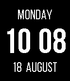
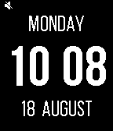
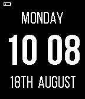
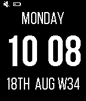
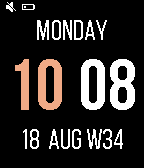
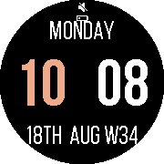
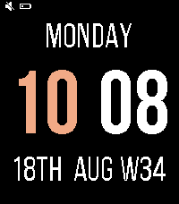

# Simply Digital

Designed to not be overly complex and give you access to the information you need (time and date).

Features:

- Bluetooth disconnection alert
  - Will notify you when you are no longer connected to your phone (via a vibration) and the top and bottom text will change colour (configurable in the settings).
- Configurable colours
  - The Hour, Minute, Date and background's colours are configurable
- Battery icon support
  - A battery icon will appear when the battery level becomes low (Configurable in the settings).
- Custom events support
  - The currently supported events are; New Year's Day, Burns Night, Halloween, Christmas Eve, Christmas Day, Boxing Day.
- Power Saver mode
  - Hides the time and date, until a flick/shake/tap of the watch
- Quick View support

## Screenshots

### Aplite

### Basalt

### Chalk

<!--  -->

### Emery

